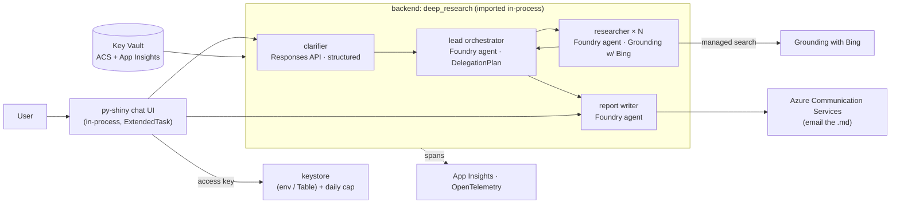
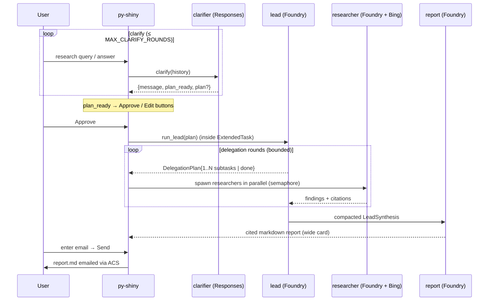
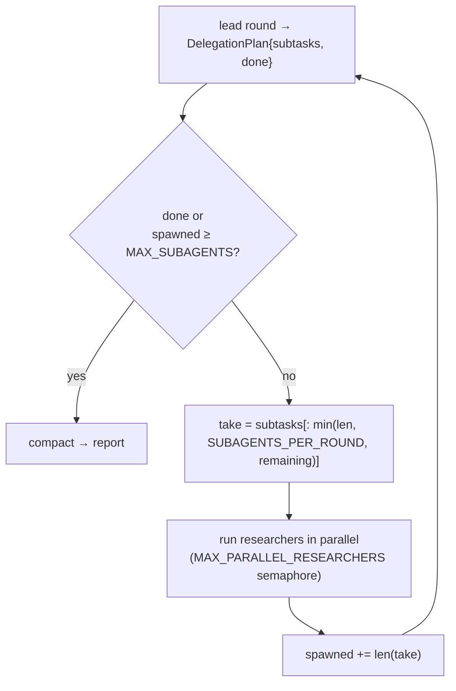
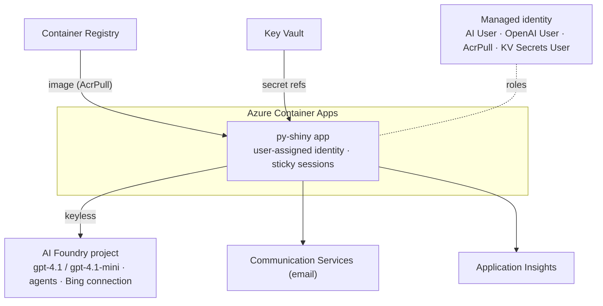

# Deep Research — Azure-native (simplified)

A small, **Azure-native** deep-research app. A **py-shiny** chat UI talks to the backend
**in-process** (no API tier): a decoupled **clarifier** turns a vague question into a
user-approved **research plan**, a **lead orchestrator** delegates to **researcher** sub-agents
(Foundry-managed, with **Grounding with Bing**) under hard cost caps, a **report writer** produces
a cited markdown report, and the user can **email** it. Observability via OpenTelemetry + Azure
Monitor, infra via **Bicep**, and everything is managed by **uv**.

This is a deliberately leaner rebuild of an earlier, more elaborate system from a repo (no FastAPI, no Azure
AI Search overflow store, no Terraform), mainly for demo purposes on what is feasible strictly via Azure resources.

> **Demo posture:** a research run lives in your browser session. Leaving or refreshing the page loses an in-progress run.

---

## Architecture



The clarifier is a stateless **Responses API** call; the lead- and sub- researchers, and report are **Foundry-managed agents** created from the markdown prompts. A **function-tool bridge** is implemented to enforce a hard subagent ceiling and cap parallelism, as well as make sure subagent spans are emitted.

## Pipeline (what a request does)



## Subagent control (the count is enforced in code)



The model *requests* work; **the code decides how much actually runs** — bounded by
`MAX_SUBAGENTS_PER_RUN` (hard ceiling), `SUBAGENTS_PER_ROUND`, and `MAX_DELEGATION_ROUNDS`. The
researcher's "≤ N searches" is a *soft* prompt budget; real spend is bounded by the subagent ceiling + per-researcher token cap.

## Deployment



---

## Repository structure

```
.
├── README.md                      # this file
├── pyproject.toml                 # uv workspace root (members: backend, frontend) + ruff/pytest
├── uv.lock                        # single committed lockfile for the whole workspace
├── .python-version                # pinned interpreter (3.11)
├── Dockerfile                     # uv-based image; runs the py-shiny app
├── azure.yaml                     # azd: bicep provision + deploy + postdeploy agent sync
├── .env.example                   # all settings (fill from the IaC outputs)
├── backend/                       # installable package `deep_research` (imported in-process)
│   ├── pyproject.toml
│   ├── prompts/                   # versioned markdown prompts (frontmatter)
│   │   ├── clarifier.md           # clarify + propose plan (Responses)
│   │   ├── lead_researcher.md     # lead agent baked instructions
│   │   ├── lead_researcher_round.md  # per-round delegation context
│   │   ├── research_agent.md      # researcher (Bing grounding + soft budget)
│   │   ├── report_writer.md       # report agent baked instructions
│   │   └── final_report.md        # per-call report brief + citation rules
│   ├── src/deep_research/
│   │   ├── config.py              # pydantic-settings (models, endpoints, caps)
│   │   ├── schemas.py             # ClarifierTurn, ResearchPlan, DelegationPlan, LeadSynthesis…
│   │   ├── prompts.py             # markdown prompt loader/renderer
│   │   ├── observability.py       # OTel + Azure Monitor + span() helper
│   │   ├── azure_client.py        # keyless Azure OpenAI (Responses) client
│   │   ├── clarifier.py           # responses.parse clarifier + 3-turn cap
│   │   ├── runtime.py             # Foundry run bridge + resolve_agent_id (by name)
│   │   ├── lead.py                # orchestrator loop + hard subagent ceiling
│   │   ├── researcher.py          # researcher run + parallel semaphore + soft-fail
│   │   ├── report.py              # report agent + guaranteed Sources section
│   │   ├── pipeline.py            # run_research: lead → compact → report
│   │   ├── tools.py               # think_tool + searches_remaining (function tools)
│   │   ├── email.py               # send_report_email via ACS
│   │   ├── guardrails.py          # Prompt Shields input guard (config-gated, fail-open)
│   │   └── keystore.py            # per-user keys + daily cap (env / Table)
│   └── tests/                     # offline tests (no Azure/network)
├── frontend/
│   ├── pyproject.toml             # depends on `deep-research` (workspace)
│   └── app.py                     # py-shiny chat UI
├── infra/bicep/                   # main.bicep + modules (Bicep only)
│   ├── main.bicep · main.parameters.json
│   └── modules/                   # ai-foundry, bing-grounding, communication, monitoring,
│                                  #   identity, registry, key-vault, container-app, storage, budget
├── utils/                         # sync_agents.py, mint_key.py, add_user.py, smoke.py, setup-github-oidc.sh
├── docs/                          # deferred (ADRs/design artifacts) — .gitkeep only
└── .github/workflows/             # ci.yml (PR + push) · deploy.yml (push to main, OIDC)
```

## Design decisions

| Decision | Choice | Why |
|---|---|---|
| Frontend ↔ backend | py-shiny imports backend **in-process**, no FastAPI | Simpler; long runs use a Shiny `ExtendedTask` so the UI never hangs |
| Lead → researcher | **Function-tool bridge + bounded delegation schema** | Only way to *enforce* a subagent cap, parallelism, and per-subagent spans in code |
| Researcher search | **Managed Grounding with Bing**, soft `≤N` cap | Standalone Bing Search v7 was retired (2025-08-11); managed search isn't code-countable |
| Clarifier | **Responses API `responses.parse`** (not a Foundry agent) | Most reliable structured output; cleanly decoupled |
| Agents created by | **`utils/sync_agents.py`** (not Bicep) | No ARM resource type for Foundry agents; app resolves them **by name** |
| Access control | **Per-user access keys** + daily run cap | Reused, tested; the cap doubles as the cost guard |
| Email | **Azure Communication Services** | Azure-native, headless, secret in Key Vault |
| Persistence | In-memory per session | Quick-demo posture (leaving the page drops the run) |

---

## Quickstart (local)

Prereqs: [uv](https://docs.astral.sh/uv/), the Azure CLI (`az`), and (to deploy)
[azd](https://learn.microsoft.com/azure/developer/azure-developer-cli/).

```bash
uv sync --all-packages                  # create the shared venv from uv.lock
az login                                # keyless auth (DefaultAzureCredential)

uv run pytest                           # offline test suite (no Azure)

# After provisioning (below), point .env at the outputs and create the agents:
cp .env.example .env                    # fill from `azd env get-values`
uv run python utils/sync_agents.py      # create/update the 3 Foundry agents from the prompts

# Mint an access key (optional locally; leave API_KEYS empty to disable the gate):
uv run python utils/mint_key.py "Me"    # add the printed name:hash to API_KEYS in .env

uv run shiny run frontend/app.py        # open the chat UI at http://localhost:8000
```

## Deploy (azd)

```bash
az login && azd auth login
azd env new dr-dev
azd env set BUDGET_ALERT_EMAILS '["you@example.com"]'   # optional
azd up                                  # provision (Bicep) + build/push image + deploy +
                                        #   postdeploy hook runs utils/sync_agents.py
```

`azd up` provisions the AI Foundry project + `gpt-4.1`/`gpt-4.1-mini` deployments (with a custom
RAI policy), Grounding with Bing, App Insights, ACS email, Key Vault, ACR, and the Container App,
then creates the agents. The app URL is output as `SERVICE_APP_URI`.

## Configuration (deploy vars)

| Setting | Default | Purpose |
|---|---|---|
| `MAIN_MODEL` / `MINI_MODEL` | `gpt-4.1` / `gpt-4.1-mini` | clarifier·lead·report / researcher |
| `MAX_SUBAGENTS_PER_RUN` | `15` | hard ceiling on researchers per run |
| `MAX_PARALLEL_RESEARCHERS` | `3` | concurrency semaphore |
| `MAX_DELEGATION_ROUNDS` | `5` | lead re-planning rounds |
| `SUBAGENTS_PER_ROUND` | `3` | max subtasks per round |
| `MAX_SEARCHES_PER_RESEARCHER` | `5` | **soft** per-researcher search budget (prompt) |
| `RESEARCHER_MAX_COMPLETION_TOKENS` | `0` | per-researcher token cap (0 = unset) |
| `RESEARCHER_MAX_RETRIES` | `3` | retry a researcher run on 429/rate-limit |
| `RESEARCHER_RETRY_BASE_SECONDS` | `2.0` | exponential-backoff base for retries |
| `MAX_CLARIFY_ROUNDS` | `3` | clarifying turns before a plan is forced |
| `MAX_RUNS_PER_KEY_PER_DAY` | `25` | per-key daily run cap (cost guard); 0 = unlimited |
| `API_KEY_STORE` / `API_KEYS` | `env` / *(empty)* | access-key store and key list |
| `BING_CONNECTION_ID`, `AZURE_AI_PROJECT_ENDPOINT`, `AZURE_OPENAI_ENDPOINT`, `ACS_*` | from IaC | endpoints / connections |
| `TRACE_CONTENT` | `false` | capture prompt/completion content in spans (privacy) |

## CI/CD

- **`ci.yml`** (PR + push): `uv sync --all-packages --frozen`, `ruff check`, `ruff format --check`,
  `pytest` (offline), `az bicep build`, and a Docker build — no Azure credentials needed.
- **`deploy.yml`** (push to `main`, keyless **OIDC**, gated Environment): `azd up` — provision →
  deploy → `utils/sync_agents.py` re-creates/updates the agents from the latest prompts (git is the
  version source of truth). One-time trust: `utils/setup-github-oidc.sh <owner/repo> <env>`.

## Observability

`setup_observability()` wires Azure Monitor + OpenTelemetry and auto-instruments the OpenAI and
Azure AI Agents SDKs. Business phases are wrapped in manual spans:
`deep_research → clarify → lead:round{n} → researcher:<topic> → report → email`. View in
Application Insights or the Foundry portal's Tracing view.

## Access control & cost

The app is gated by per-user access keys (only SHA-256 hashes are stored); each key has a daily run
cap that doubles as a cost guard. Spend is further bounded by the hard subagent ceiling,
per-researcher token cap, low model capacity, scale-to-zero, and a resource-group budget with email
alerts. Use the **Table Storage** key store (`ENABLE_API_KEY_TABLE=true`) to add/revoke users with
`utils/add_user.py` and no redeploy.

This is mainly applied to avoid abuse of the agent and protect my spending!

## Limitations (demo)

- A research run is session-scoped — **leaving or refreshing the page loses an in-progress run**.
- The `≤ N searches` per researcher is advisory (managed Grounding with Bing is server-side).
- `docs/` (ADRs / deeper design artifacts) is deferred.
